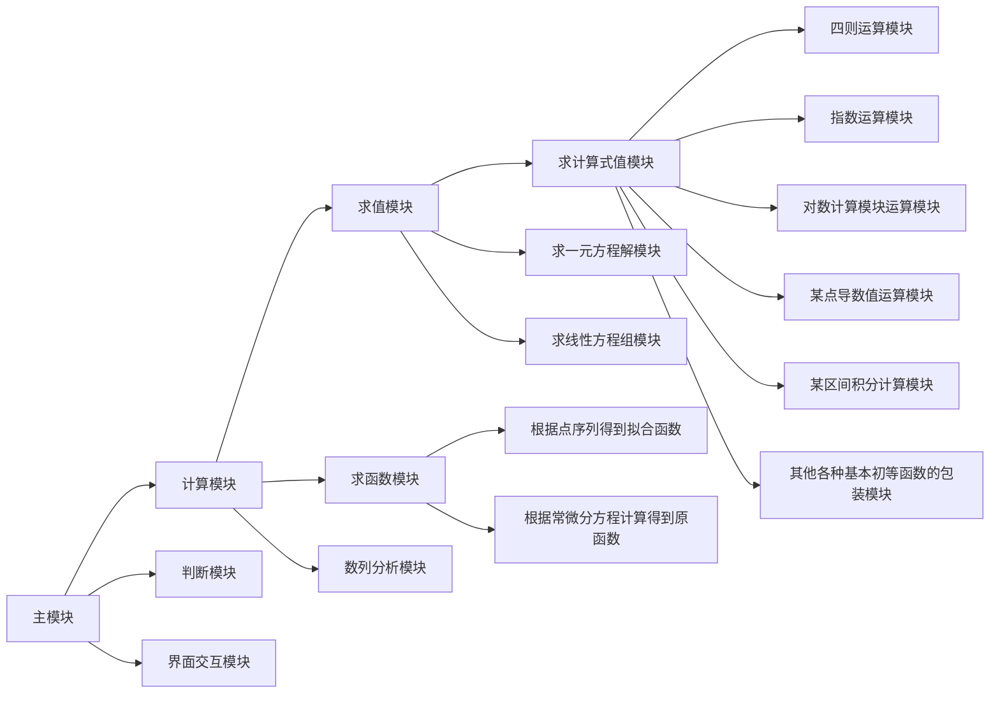

# 万能公式计算器(utinity formula calculator,ufc)

### 目的

写个可以自己用的公式计算工具，函数画图工具，和数列分析工具。

#### 要求

1. 界面简洁易懂

2. 容易使用。也就是要尽量让读者能够使用自然的计算机键盘的语言完成自己的输入和命令的表达，尽量不要使用复杂的指令，应当最大限度地降低使用者的学习成本

3. 稳定！！！具有高度健壮性，对于各种非法输入不会崩溃，并且能够做到简单地自动纠错（\*暂时可以不实现）

4. 高效！比如使用栈等数据结构代替递归的方式对输入的公式的多嵌套进行处理

#### 预期界面


#### 预期功能

在文本框输入公式或者是数据的后，点击对应功能的按钮能够返回对应的结果

* 求值

  * 求式值运算

    根据输入的初等函数以及初等函数的积分/导数的有限次混合的式子返回值

    ```javascript
    求初等函数值
    直接输入一个初等函数的存数值的式子
    2+3^(2+44sin(pi))/(5e^2)
    然后就会返回这个式子计算得出的函数值
    
    
    求导数，也就是求某函数的导函数在某一点的函数值
    输入
    D(  a , x^2+3sin(x)+55x^(2+cos(x))  )
    则返回关于x的函数x^2+3sin(x)+55x^(2+cos(x))在x=a处的导数值
    
    
    求积分
    J(a~b,x^2+3e^(cos(x)+x^2) )
    则返回关于x的函数x^2+3e^(cos(x)+x^2)在x在a到b的区间之间的积分
    注意的是，这里面的函数就算只是初等函数，也可能是没有办法使用牛顿的方法求出原函数的，所以应该采用
    数值方法去求解积分值
    ```

    规范

    1. 定义运算表达

       ```javascript
       如果是定义的某种计算方法，则通过对应方法的首字拼音大写字母加括号来实现
       
       比如求导(dao)数，则表达为D(a,f),其中a为一个常量参数，指定求导的位置，
       而是一个仅仅含有一个未知数的函数，也就是要求导数的原函数
       
       又比如求积(ji)分，则表达式为J(a~b,f)
       其中a,b为两个常数，表示求积分的范围(他们应当是有限的数，暂时不考虑无穷的情况)
       
       又比如说直接求某点的函(han)数值，则表达式为H(a,f)
       其中a为求值的点，f为带求的含有一个未知数的式子。
       
       
       后面如果要加入新的需要函数式的运算，也按照如上参数格式进行定义
       X(...)
       一个大写的字母表示运算的名称，括号内是运算的参数，最后面是函数式子
       
       至于一些其他的对于常量的计算。
       比如a^b表示a的b次方
       a*b表示a乘以b
       a/b表示a除以b
       
       至于特殊的常量运算
       a!
       a为一个非负整数或者说是一个整数的阶乘
       
       至于数学函数
       标准写法
       应该是函数名(参数)
       比如sin(m)
       表示对m的求sin值。但是里面的m不一定要是一个直接给出的值，还可以是一个表示值的表达式，
       比如sin(pi)也可以写成sin(pi*3/2+pi/4)等
       
       用户定义的变量的名字不应该与内置的数学函数的名字冲突
       ```

    2. 定义一些常量的规范

       ```javascript
       用e表示常量自然对数
       用pi表示常量圆周率。
       这两个应该是程序内置的常量
       
       后面我们应该允许用户自定义常量。
       用户自定义常量规范应该也为若干个连续的小写字母，比如a，比如ab
       用户定义常量应当可以覆盖我们定义的常量:
       比如我们程序中默认定义pi=3.1415926,用户在输入中输入定义常量语句pi=3.14之后。
       该次计算中我们都会把pi当做3.14来处理
       
       ps:常量规范，这个不是计算模块应该关心的事情。
       事实上一个公式字符串在传递给计算模块之前应该经过专门的预处理模块用常量替换了常量符号之后
       再把仅仅含有运算表达和常量的公式串传给计算模块
       
       ```

  * 求未知数值运算，也就是解方程

    解一元方程

    ```javascript
    通过输入的一元方程计算并给出方程的若干个解（如果是有限个解的话，则给出全部，若是无限个解的话，则给出在【助手！！】中设定的默认范围内的解
    
    输入的标准样式应该为:
    f=0
    左边是一个一元函数，等号右边为0。这种方程我们称之为非齐次方程。其他等号右边非0的方程都可以称为非齐次方程
    
    e.m.
    x+x^2=0
    则会返回方程的解-1和0
    
    也应当能够支持非齐次的方程输入，比如:
    x+x^2=2
    该方程输入等价于输入x+x^2-2=0
    结果会把两个解1，和-2输出回屏幕上
    
    ```

    解线性方程组

    ```javascript
    可以接受完全给出的方程组的表达式
    1*x+2*y=1
    2*x+1*y=22
    则会依次返回方程组解的列表
    注意！该输入的字符串其实是一个带着一个换行符的格式，就像1*x+2*y=1\n2*x+1*y=22
    
    也应当可以接受简化形式的输入
    比如
    1,2=1
    2,1=3
    等号前面是未知数的系数的用逗号隔开的一个排列，从第一个未知数的系数一直排到最后一个未知数的系数
    ```

* 求函数

  该功能会根据输入的信息给出的还原成指定格式的函数，并且绘制出相应图像

  1. 输入一个具体函数表达式，绘制出该表达式的图像

  2. 输入一系列点的元组，求出这些元组表示的点的拟合函数（经典的拟合比如说最小二乘拟合，能够让这些点到拟合函数的距离差之和最小),并且绘制

     出拟合函数的图像

  3. 隐式函数求其显函数的拟合

     ```javascript
     比如输入
     x+y*2=3
     在该模式中会被判断为隐函数,会被求x，y两个变量的拟合函数，并作出图像
     比如会返回x=-y*2+3的拟合函数表达式，并且绘制出其图像
     ```

* 数列分析

  输入一系列数，返回对这系列数据的分析

  ```javascript
  输入如下数字，应该返回如下结果
  
  1 2 3 4 99 100 
  
  数列和：209.000000,数列平均值：34.833333
  
  平均值的标准偏差：22.406100
  
  算术平均值的标准偏差：9.147252
  ```

* 助手!!!

  在助手里面可以修改各种默认设置，以及查看使用指南

#### 模块划分

##### 模块应该关注的事情，或者说应该具备的责任

一个模块应该越少关注外界的事物越好，与外界的接口越少越好，如非必要，不应该直接接受外界的修改，如非必要，也不轻易接受外界的参数。

对于计算模块来说，不应该关心传入的数据的正确，而是全部代码集中在功能的实现上来，把对输入的数据的正确性的判断交给判断模块

```javascript
毕竟，如果每个计算模块都写一个判断输入数据是否符合它的标准的方法，每个计算的模块的每个计算方法里面都在执行方法前先判断一下
输入的正确与否的话，很可能会造成浪费。
一个正确的输入，只要判断一次是正确的就够了。
由专门的判断模块去判断是否是合法的输入，是哪种类型的输入。
```

所以，每个模块的主要计算方法中，应该只实现计算功能，模块中可以定义其他辅助函数完成计算。

此外，每个模块应该提供一个判断数据是否是符合他需要的数据类型的方法

比如说对于计算纯四则运算模块

```javascript
它应该提供:
(ps:下面用部分uml的语法描述一个模块应该提供给外界的接口)

count_value(String string):double
输入公式字符串，返回一个double型的值

if_match(string string):boolean
判断输入的字符串是否是符合要求的公式字符串，并返回判断结果

注意！
count_value内部的方法不应该调用if_match方法，而是只由判断模块使用判断方法
```

对于判断模块

```javascript
jud_kind(String string):String
会根据用户输入的字符串判断其计算类型是属于求函数型还是求值型还是数列分析型还是不合法类型，
并返回表示判断结果的字符串

在该方法的内部，会按照一定的顺序和层次调用不同计算模块的判断方法来完成判断
```

对于控制模块（也可以称为主模块）

```javascript
统筹所有模块
控制图像模块
以及调用判断模块的方法，
根据判断的结果调用计算模块计算返回结果
又或者是根据判断结果返回错误提示信息
```

界面交互模块

```javascript
只关注如何显示信息，以及如何获取用户输入的信息
```

##### 模块划分图



#### 自助式协作方式概述

每个参与者根据自己的兴趣和时间等因素的考量，选择自己想要完成的模块。

建立一个自己的文件夹,在自己的文件夹里面完成自己的模块和对模块的测试。在自己的文件夹里面用一个md文档描述自己准备做的文档和正在做的文档，使用的技术方案以及进度。

然后再把合格的模块添加到真正的程序代码中。如果两个人用两种实现完成了同一个模块，那么讨论把效果更好的模块加入到最终实现的代码中。

最终实现专门占一个文件夹outcome.里面的ui用来存储运算模块，里面的count用来存储计算模块，用jud文件夹存储判断模块，在三个模块外面的main.py中编写主控制程序调用各个写好的模块完成程序

#### 最终程序完成进度图